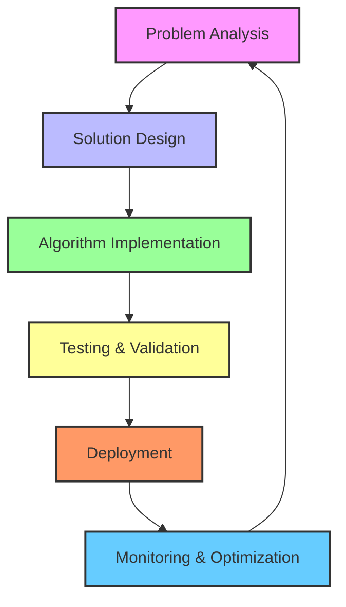

# GitHub Profile README for msobanShaukat

I'll create a professional, visually appealing GitHub profile README that highlights your AI and software engineering expertise with badges, emojis, and a flowchart.

```markdown
# 👋 Hello, I'm Soban Shaukat!

**`Artificial Intelligence Engineer & Software Developer`**

[](https://www.linkedin.com/in/yourprofile/)
[](mailto:your-email@gmail.com)
[](https://twitter.com/yourprofile)

---

## 🚀 About Me

🎓 **MSc in Artificial Intelligence** at **NUST** specializing in **ML, DL, CV, and NLP**

🤖 **Certified Agentic AI & Robotics Engineer (CAARE)** at **Panaversity**

💡 Passionate about developing **intelligent software systems** that bridge **AI theory and real-world impact**

🎯 Focused on **autonomous agent frameworks** and **robust software backends** for AI applications

🔭 Currently seeking opportunities to apply my skills in **AI, robotics, and software engineering** to challenging problems

---

## 🛠️ Technologies & Skills

### 🤖 AI & Machine Learning


### ⚡ Backend Development


### 🔧 AI Agent Technologies


### 🤖 Robotics


---

## 📚 Education

| Degree | Institution | Period | Focus |
| :--- | :--- | :--- | :--- |
| **MSc Artificial Intelligence** | NUST | Sep 2024 - Sep 2027 | ML, DL, CV, NLP |
| **CAARE Certification** | Panaversity | Jul 2025 - Dec 2026 | Agentic AI & Robotics |

---

## 📊 Development Workflow



---

## 🔥 My Projects

### 🤖 Autonomous Agent Framework
**Multi-agent system for intelligent task automation**


### 🎯 AI-Powered Analytics Platform
**Real-time data processing with machine learning insights**


---

## 📈 GitHub Stats


---

## 📫 Let's Connect!

I'm always interested in:
- 🤖 AI and robotics projects
- 🔧 Software engineering challenges
- 📚 Research collaborations
- 💼 New opportunities

**Feel free to reach out!** 🚀
```
